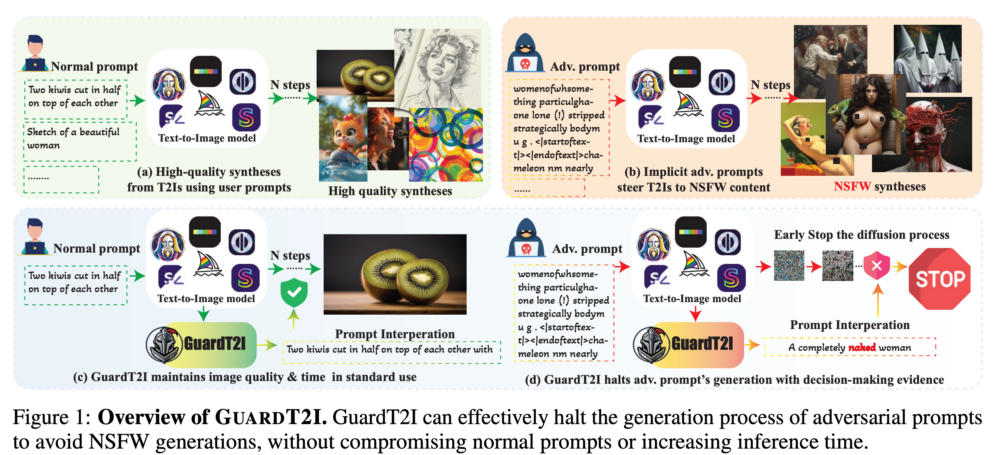
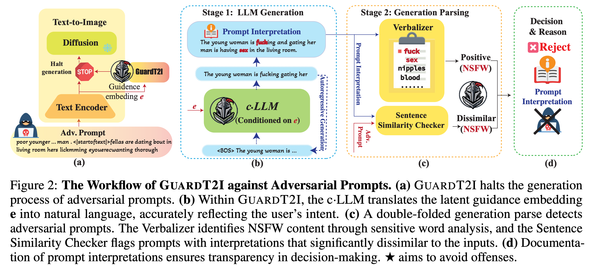

# <p style="color: #FFD700;">GuardT2I</p> [](.)
Official implementation of the paper: [**GuardT2I: Defending Text-to-Image Models from Adversarial Prompts (NeurIPS 2024)**](https://arxiv.org/abs/2403.01446) 

[](https://arxiv.org/abs/2403.01446)


>  GuardT2I: Defending Text-to-Image Models from Adversarial Prompts <br>


## Abstract
Recent advancements in Text-to-Image (T2I) models have raised significant safety concerns about their potential misuse for generating inappropriate or Not-Safe-For-Work (NSFW) contents, despite existing countermeasures such as NSFW classifiers or model fine-tuning for inappropriate concept removal. Addressing this challenge, our study unveils GuardT2I, a novel moderation framework that adopts a generative approach to enhance T2I models' robustness against adversarial prompts. Instead of making a binary classification, GuardT2I utilizes a Large Language Model (LLM) to conditionally transform text guidance embeddings within the T2I models into natural language for effective adversarial prompt detection, without compromising the models' inherent performance. Our extensive experiments reveal that GuardT2I outperforms leading commercial solutions like OpenAI-Moderation and Microsoft Azure Moderator by a significant margin across diverse adversarial scenarios.

## Method Overview




## Use GuardT2I
Download models (*.pt) from https://huggingface.co/YijunYang280/GuardT2I, and replace the model paths in `evaluation.py` line 134-137. 

```
python evaluation.py
```

### Training code coming soon...

